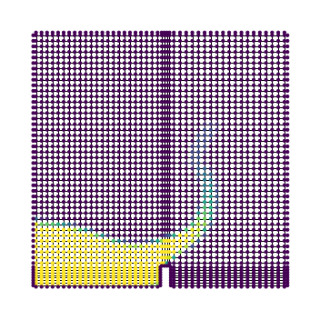

--------------------------------------------------------------------------------
[](https://github.com/gfngoncalves/foam_graph/actions/workflows/main.yml) [](https://codecov.io/gh/gfngoncalves/foam_graph) [](https://foamgraph.readthedocs.io/en/latest/?badge=latest)

FoamGraph is a Python library for manipulating OpenFOAM cases as graphs.

## Installation

FoamGraph requires [PyTorch](https://pytorch.org/get-started) and [PyTorch Geometric](https://pytorch-geometric.readthedocs.io/en/latest/notes/installation.html). It's recommended to check the documentation of these packages for intallation instructions. The following is an example for conda installation:

```bash
conda install pytorch torchvision cudatoolkit={CUDA} -c pytorch
conda install pyg -c pyg
```

where `{CUDA}` should be replaced by the desired CUDA version.

Use the package manager [pip](https://pip.pypa.io/en/stable/) to install FoamGraph.

```bash
pip install .
```

## Example

Currently, the package requires that cell centers are written by OpenFOAM.
That can be achieved with the following command (requires [OpenFOAM](https://www.openfoam.com/)):

```bash
postProcess -func writeCellCentres
```

The following example loads a case folder as a graph:

```python
from torch_geometric.data import download_url, extract_tar
from foam_graph.utils.graph_from_foam import read_foam

download_url("https://github.com/gfngoncalves/openfoam_cases/blob/main/damBreak.tar.xz?raw=true", ".")
extract_tar("damBreak.tar.xz", ".", mode="r:xz")

graph = read_foam(
    "damBreak",
    ("alpha.water",),
    read_boundaries=True,
)
```

The resulting graph is a [StaticGraphTemporalSignal](https://pytorch-geometric-temporal.readthedocs.io/en/latest/modules/signal.html) object for static meshes, or  a DynamicGraphTemporalSignal for dynamic meshes.

The package alo provides some convenience functions for plotting and preprocessing data. As an example, a timestep can be plotted with:
```python
import matplotlib.pyplot as plt
from foam_graph.visualization.graph_plotting import plot_graph

field_name_plot = "alpha.water"
time_idx = 5

fig, ax = plt.subplots(figsize=(5, 5))
plot_graph(graph[time_idx], field_name_plot, ax=ax)

plt.tight_layout()
plt.show()
```



More examples are provided in the *examples* folder.

## Contributing
Pull requests are welcome. For major changes, please open an issue first to discuss what you would like to change.

Please make sure to update tests as appropriate.

## License
[MIT](https://choosealicense.com/licenses/mit/)