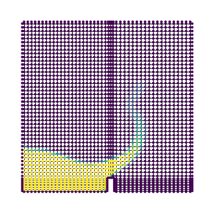

Example
======================================

Currently, the package requires that cell centers are written by OpenFOAM.
That can be achieved with the following command (requires OpenFOAM)::

    postProcess -func writeCellCentres

The following example loads a case folder as a graph::

    from torch_geometric.data import download_url, extract_tar
    from foam_graph.utils.graph_from_foam import read_case

    download_url("https://github.com/gfngoncalves/openfoam_cases/blob/main/damBreak.tar.xz?raw=true", ".")
    extract_tar("damBreak.tar.xz", ".", mode="r:xz")

    graph = read_case(
        "damBreak",
        ("alpha.water",),
        read_boundaries=True,
    )

The resulting graph is a StaticGraphTemporalSignal object for static meshes, or  a DynamicGraphTemporalSignal for dynamic meshes.

The package alo provides some convenience functions for plotting and preprocessing data. As an example, a timestep can be plotted with::

    import matplotlib.pyplot as plt
    from foam_graph.visualization.graph_plotting import plot_graph

    field_name_plot = "alpha.water"
    time_idx = 5

    fig, ax = plt.subplots(figsize=(5, 5))
    plot_graph(graph[time_idx], field_name_plot, ax=ax)

    plt.tight_layout()
    plt.show()

